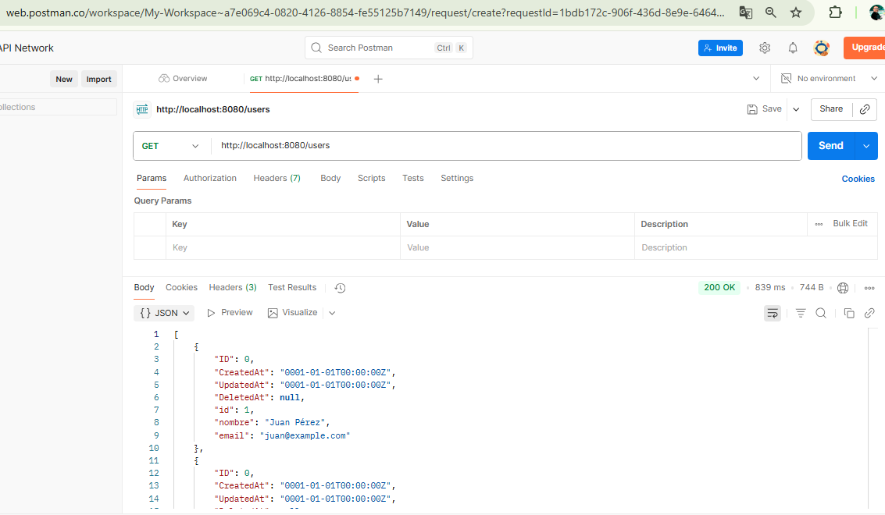
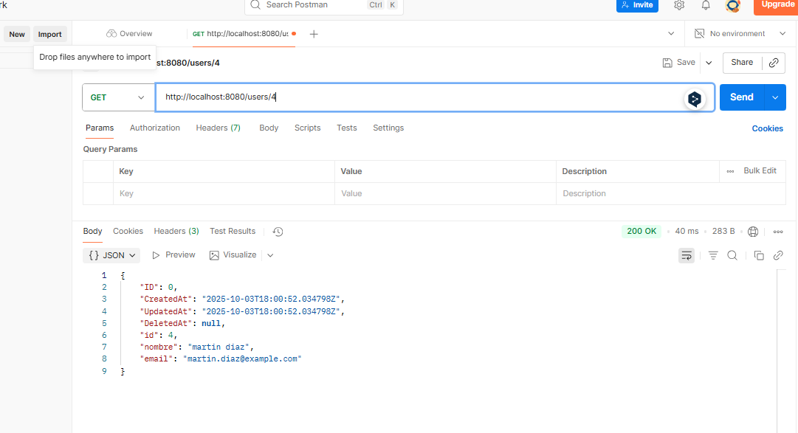
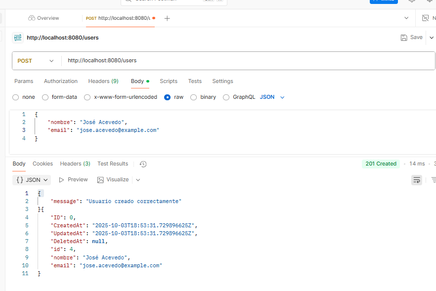
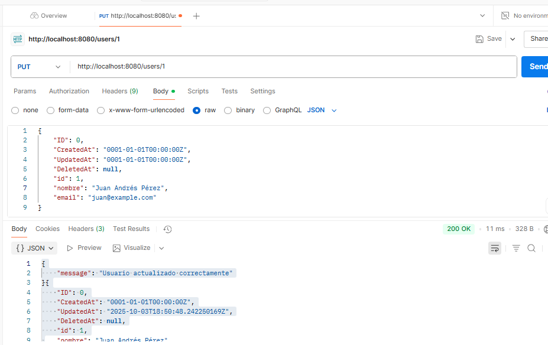
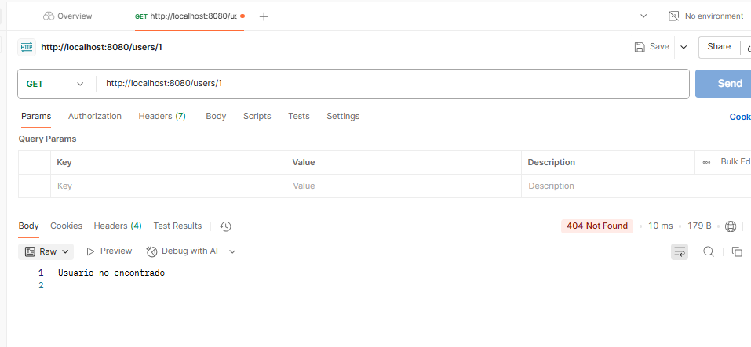
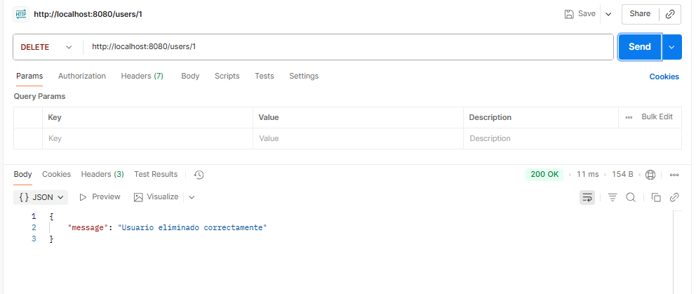
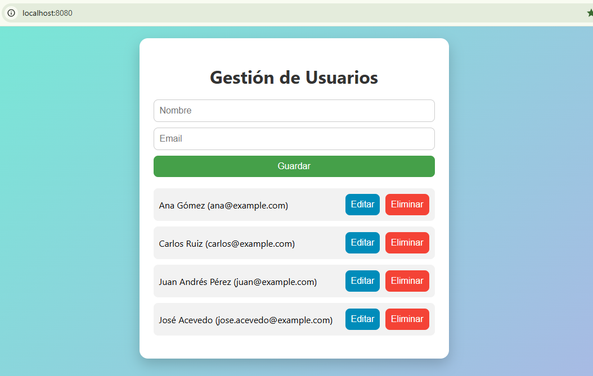

# Prueba Desarrollador Backend Go + PostgreSQL + Frontend + Docker

## 🔹 Descripción
Proyecto CRUD completo de **usuarios** utilizando **Go**, **GORM**, **PostgreSQL** y un **frontend básico con HTML y CSS**.  
Permite **crear, leer, actualizar y eliminar usuarios** mediante un **API REST** y un frontend visual.

---

## 🔹 Tecnologías usadas
- Go 1.21
- PostgreSQL 15
- GORM (ORM de Go)
- HTML + CSS
- Docker y Docker Compose

---

## 🔹 Requisitos
- Docker y Docker Compose instalados
- Go 1.21 (opcional si quieres ejecutar fuera de Docker)

---

## 🔹 Estructura del proyecto
```bash
    prueba-backend/
│
├── main.go                 # Punto de entrada del proyecto
├── go.mod                  # Módulo de Go
├── go.sum
│
├── config/                 # Configuración de la DB y variables de entorno
│   └── config.go
│
├── controllers/            # Lógica de controladores HTTP
│   └── userController.go
│
├── repository/             # Implementación de repositorios (interfaz + implementación)
│   ├── userRepository.go
│   └── implementationInterface.go
│
├── models/                 # Definición de structs GORM
│   └── user.go
│
├── routes/                 # Registro de rutas HTTP
│   └── routes.go
│
├── frontend/               # Archivos estáticos para el frontend
│   ├── index.html
│   └── styles.css
│
├── docker-compose.yml      # Contenedores (Postgres + Go API)
├── Dockerfile              # Imagen del backend Go
├── init/                   # Scripts de inicialización de la DB
│   └── init.sql
└── README.md               # Documentación del proyecto
```

## Arquitectura del proyecto y Patrones de diseños implememtados

### 1️⃣ Arquitectura general
El proyecto sigue una arquitectura de en capas muy usado en aplicaciones backend limpias

```bash
Frontend -> Controllers -> Services/Repositories -> Database (GORM/Postgres)
```
***- Frontend:*** HTML/CSS/JS servido desde Go. Interactúa con la API REST.
***- Controllers:*** Gestionan la lógica HTTP, reciben peticiones y devuelven respuestas.
***- Repositories:*** Encapsulan la lógica de acceso a datos con GORM.
***- Models:*** Representan la estructura de la base de datos (ORM).
***- Config:*** Configuración de la DB y variables de entorno.

### 2️⃣ Patrones de diseño implementados
#### a) Repository Pattern
**Qué es:** Encapsula la lógica de acceso a datos, separando el acceso a la DB del resto de la aplicación.
**Dónde se ve:** repository/userRepository.go + repository/implementationInterface.go
**Ventaja:** Permite cambiar la implementación del almacenamiento (Postgres, SQLite, memoria) sin afectar a los controladores.

```bash
type UserRepository interface {
    GetAll() ([]models.User, error)
    GetByID(id uint) (models.User, error)
    Create(user models.User) (models.User, error)
    Update(user models.User) (models.User, error)
    Delete(id uint) error
}
```

### b) Dependency Injection

**Qué es:** Inyectar dependencias en lugar de crearlas directamente dentro del componente.

**Dónde se ve:** En los controladores al recibir la instancia del repositorio:
```bash
func NewUserController(repo repository.UserRepository) *UserController {
    return &UserController{Repo: repo}
}
```

**Ventaja:** Facilita pruebas unitarias y desacopla componentes.

### c) Factory / Constructor

**Qué es:** Funciones que crean instancias de objetos utilizando una configuración específica.

**Ventaja:** Facilita pruebas unitarias y desacopla componentes.

### c) Factory / Constructor

**Qué es:** Funciones que crean instancias de structs con sus dependencias ya configuradas.

**Dónde se ve:** *-NewUserController() y NewUserRepository()*

### d) MVC ligero (Model-View-Controller)

**Modelos:** *models/User.go* → representan la base de datos.

**Controladores:** *controllers/UserController.go* → manejan las solicitudes HTTP.

**Views:** Archivos HTML/CSS (*frontend/*) → interacción con el usuario.

**Ventaja:** Separación de responsabilidades, más mantenible.

### e) Encapsulación / Single Responsibility

Cada paquete tiene una única responsabilidad:

**config** → configuración y conexión a DB.

**repository** → acceso a datos.

**controllers** → lógica de API.

**routes** → registro de endpoints.

### f) RESTful API

Cada recurso (User) tiene rutas bien definidas:

*GET /users* → listar usuarios

*GET /users/{id}* → obtener usuario por ID

*POST /users* → crear usuario

*PUT /users/{id}* → actualizar usuario

*DELETE /users/{id}* → eliminar usuario

**Sigue convenciones REST, haciendo que el backend sea consumible desde cualquier frontend.**

### 3️⃣ Buenas prácticas de arquitectura

- **Migración automática con GORM (AutoMigrate)** → evita inconsistencias entre DB y modelos.

- **Configuración mediante variables de entorno** → separación de entornos (dev, prod).

- **Uso de http.ServeMux** → centraliza rutas y facilita middleware futuro.

- **Contenedores Docker** → entorno reproducible y aislado.

## 🔹 Instalación y ejecución
1. Clonar el repositorio:
```bash
git clone https://github.com/whilrod/prueba-backend.git
cd prueba-backend
```
---

2. Levantar los contenedores:
```bash
    docker-compose up --build
```
Esto iniciará:

- Contenedor postgres_db con la base de datos inicializada.
- Contenedor go_api corriendo en http://localhost:8080

3. Acceder al frontend en tu navegador:

- http://localhost:8080

## 🔹 Documentación de uso del API REST
#### ENDPOINTS
| Método | Ruta | Descripción | Body/Params |
| :--- | :---: | ---: | ---: |
| GET | /users | Lista a todos los usuarios | — |
| GET | /users/{id} | Obtiene un usuario por ID | id en URL |
| POST | /users | Crea un usuario | JSON: { "nombre": "Juan", "email": "juan@example.com" } |
| PUT | /users/{id} | Actualiza un usuario | JSON: { "nombre": "Nuevo", "email": "nuevo@example.com" } |
| DELETE | /users/{id} | Elimina un usuario | id en URL |

#### Ejemplos de uso

- Consultar la lista de usuarios (GET)

- Consultar un usuario por ID (GET)

- Crear un usuario (POST)

- Actualizar un usuario (PUT)


- Eliminar un usuario (DELETE)


## 🔹 Script de creación de base de datos (init.sql)

```sql
-- Crear usuario para la app
CREATE USER app_user WITH PASSWORD 'app_pass';

-- Darle permisos
GRANT ALL PRIVILEGES ON DATABASE prueba_db TO app_user;

-- Tabla usuarios
CREATE TABLE IF NOT EXISTS usuarios (
    id SERIAL PRIMARY KEY,
    nombre VARCHAR(100) NOT NULL,
    email VARCHAR(100) UNIQUE NOT NULL,
    creado_en TIMESTAMP DEFAULT CURRENT_TIMESTAMP
);

-- Insertar fila inicial
INSERT INTO usuarios (nombre, email) VALUES
('Juan Pérez', 'juan@example.com'),
('Ana Gómez', 'ana@example.com'),
('Carlos Ruiz', 'carlos@example.com');
```
* Nota: Este script se ejecuta automáticamente

## 🔹 Frontend

- Archivos HTML y CSS servidos desde Go.
- Permite interactuar con todos los endpoints del CRUD.
- Formulario de creación/edición, lista de usuarios y botones de guardar, editar y eliminar.
- Estilos simples pero agradables con CSS puro.


